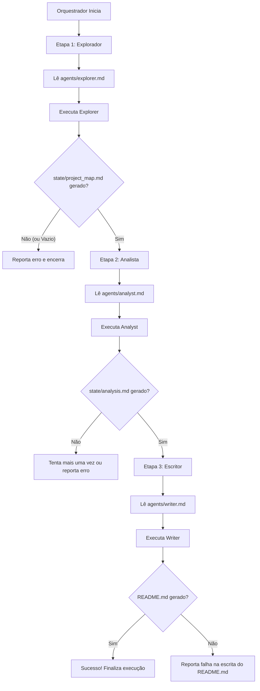

# Orquestrador de Agentes: Gerador de README.md

Este documento define a arquitetura, o registro de subagentes e o fluxo de execução para a geração automática de arquivos `README.md` profissionais. O modelo orquestrador que inicia a execução deve usar este arquivo como guia para despachar os subagentes apropriados nas etapas corretas.

---

## 🧭 Contexto Geral e Escopo

O objetivo deste sistema é analisar a estrutura, manifestos e arquivos de código de um repositório de software para gerar um arquivo `README.md` de alta qualidade.
- **Escopo ideal:** Microserviços backend, APIs REST, sites/páginas web simples e utilitários CLI (até ~50 arquivos relevantes).
- **Entrada:** Um repositório local acessível pelas ferramentas de sistema.
- **Saída:** Um arquivo `README.md` completo e profissional na raiz do projeto analisado.

---

## 🤖 Registro de Subagentes

Os subagentes são invocados usando o mecanismo nativo de subagentes (dispatching) do modelo orquestrador. Cada subagente possui uma responsabilidade clara, consome arquivos específicos da pasta `state/` e produz outros arquivos nela.

### 1. Explorador (`Explorer`)
- **Prompt:** `agents/explorer.md`
- **Responsabilidade:** Mapear a estrutura física do projeto, identificar tecnologias, arquivos de manifesto e pontos de entrada (entry points).
- **Ferramentas permitidas:** `list_directory`, `read_file`, `find_path`, `grep`.
- **Entrada:** Diretório raiz do projeto.
- **Saída:** Escreve em `state/project_map.md`.

### 2. Analista (`Analyst`)
- **Prompt:** `agents/analyst.md`
- **Responsabilidade:** Analisar os arquivos indicados pelo Explorador, extrair as funcionalidades principais, rotas/endpoints, regras de negócio chaves e dependências, compilando tudo no template de análise.
- **Ferramentas permitidas:** `read_file`, `grep`.
- **Entrada:** `state/project_map.md` e o código-fonte do projeto.
- **Saída:** Escreve em `state/analysis.md` (utilizando o template `templates/project_analysis_template.md`).

### 3. Escritor (`Writer`)
- **Prompt:** `agents/writer.md`
- **Responsabilidade:** Redigir a versão final do `README.md` aplicando as diretrizes de estilo, clareza e estrutura profissional.
- **Ferramentas permitidas:** `read_file`, `write_file`.
- **Entrada:** `state/analysis.md`, `skills/readme_standards.md` e `templates/readme_template.md`.
- **Saída:** Cria ou sobrescreve o arquivo `README.md` na raiz do projeto analisado.

---

## 🔄 Roteiro de Execução e Orquestração

O modelo orquestrador deve seguir estritamente o roteiro abaixo. Cada etapa deve ser validada antes de prosseguir.

### Instruções Passo a Passo para o Orquestrador

#### **Passo 1: Mapeamento do Projeto (Explorador)**
1. Leia o prompt do Explorador em `agents/explorer.md`.
2. Inicie uma sessão de subagente para o **Explorador** passando o prompt e o contexto do repositório.
3. Aguarde a conclusão.
4. **Validação:** Verifique se o arquivo `state/project_map.md` foi gerado e não está vazio. Se estiver vazio ou ausente, interrompa o fluxo e informe o usuário.

#### **Passo 2: Análise Técnica (Analista)**
1. Certifique-se de que `state/project_map.md` e `templates/project_analysis_template.md` estejam acessíveis.
2. Leia o prompt do Analista em `agents/analyst.md`.
3. Inicie uma sessão de subagente para o **Analista** com o prompt lido.
4. Aguarde a conclusão.
5. **Validação:** Verifique se o arquivo `state/analysis.md` foi gerado. Caso o arquivo esteja ausente, faça mais uma tentativa de despacho. Se falhar novamente, encerre a execução informando a falha no analista.

#### **Passo 3: Redação da Documentação (Escritor)**
1. Certifique-se de que `state/analysis.md`, `skills/readme_standards.md` e `templates/readme_template.md` estejam acessíveis.
2. Leia o prompt do Escritor em `agents/writer.md`.
3. Inicie uma sessão de subagente para o **Escritor** com o prompt lido.
4. Aguarde a conclusão.
5. **Validação:** Verifique se o arquivo `README.md` foi criado ou atualizado na raiz do repositório analisado. Se sim, conclua a tarefa com sucesso e apresente um breve resumo.

---

## ⚠️ Diretrizes e Tratamento de Exceções

O orquestrador e os subagentes devem obedecer às seguintes regras de segurança e robustez:

1. **Privacidade e Segurança:** Nunca leia ou inclua no estado arquivos de credenciais ou segredos (como `.env`, `*.key`, `*.pem`, `credentials.json`). Se detectados, ignore-os silenciosamente.
2. **Limite de Contexto (Arquivos Grandes):** Se um arquivo de código for muito extenso (ex: mais de 600 linhas), leia apenas o cabeçalho, as importações, as primeiras 100 linhas e as últimas 100 linhas para extrair a lógica principal, registrando um aviso de corte no arquivo de análise.
3. **Projetos não Estruturados:** Se o Explorador não encontrar arquivos de manifesto ou arquivos de código conhecidos, ele deve registrar no `project_map.md` quais arquivos encontrou e marcar a stack como "Desconhecida/Genérica", permitindo que o Analista tente interpretar os scripts manualmente.
4. **Limpeza:** Os arquivos criados na pasta `state/` são temporários. Eles servem apenas para a passagem de dados entre os subagentes de uma mesma execução e não devem ser incluídos em commits de produção (devem estar no `.gitignore`).
