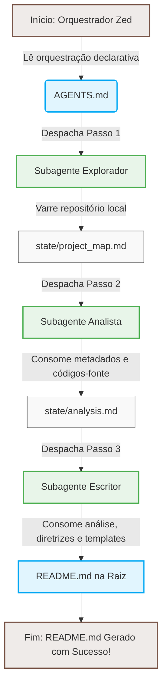

# 🤖 readMe-ia

[](LICENSE)
[]()
[](https://zed.dev)
[]()

O **readMe-ia** é uma solução de orquestração multi-agente declarativa e de alta performance desenvolvida para automatizar a geração de arquivos `README.md` de nível profissional. Executado de forma nativa dentro do ecossistema de IA da IDE Zed, ele elimina o esforço manual e repetitivo de documentação ao mapear automaticamente o repositório, extrair as particularidades técnicas do código-fonte e compilar tudo em uma documentação moderna, completa e pronta para produção.

---

## 📌 Índice

- [🚀 Funcionalidades](#-funcionalidades)
- [🏗️ Arquitetura e Estrutura do Projeto](#%EF%B8%8F-arquitetura-e-estrutura-do-projeto)
- [⚙️ Pré-requisitos e Configuração](#%EF%B8%8F-pré-requisitos-e-configuração)
- [💻 Como Executar o Projeto](#-como-executar-o-projeto)
- [🔌 API Endpoints](#-api-endpoints)
- [🛠️ Tecnologias Utilizadas](#%EF%B8%8F-tecnologias-utilizadas)
- [📄 Licença](#-licença)

---

## 🚀 Funcionalidades

Abaixo estão listadas as principais funcionalidades que este sistema disponibiliza para garantir a excelência no processo de documentação:

- **Mapeamento Automatizado de Diretórios (`Explorer`):** Realiza uma varredura profunda no repositório para identificar a árvore de diretórios, linguagens utilizadas, arquivos de manifesto de dependências e pontos de entrada (`entry points`). Os detalhes são persistidos no arquivo de estado temporário `state/project_map.md`.
- **Análise Técnica Guiada por Metadados (`Analyst`):** Investiga inteligentemente os arquivos de código e de configuração chaves listados pelo mapeamento. Extrai de maneira automatizada as regras de negócio, endpoints, portas, variáveis de ambiente e dependências, compilando-as de acordo com um template em `state/analysis.md`.
- **Geração e Redação Automatizada de README (`Writer`):** Lê os insights consolidados da análise técnica e redige a versão final do `README.md` na raiz do projeto, aplicando boas práticas de estilo, tom de voz e formatação visual.
- **Orquestração Declarativa Multi-Agente baseada em Markdown:** Utilização do arquivo `AGENTS.md` como motor declarativo que define as responsabilidades, ferramentas e o roteiro estrito de execução do pipeline multi-agente dentro do Zed AI Agent, sem a necessidade de codificação imperativa.
- **Gerenciamento Seguro de Estado de Execução:** Passagem e sincronização de dados entre as etapas através de arquivos Markdown de estado temporários localizados em `state/`, devidamente ignorados por controle de versão para garantir a limpeza do projeto.
- **Tratamento Inteligente de Limites de Contexto:** Proteção contra estouro de contexto de LLM por meio de leituras parciais de arquivos de código extensos (acima de 600 linhas) de maneira automatizada e segura.

---

## 🏗️ Arquitetura e Estrutura do Projeto

O projeto adota o padrão arquitetural de **Orquestração Multi-Agente Declarativa**, com pipeline linear e passagem de dados desacoplada por meio de arquivos Markdown de estado local.

### Fluxo Geral de Dados

O ciclo de vida da geração automática do README segue a seguinte ordem de execução sequencial:



### Estrutura de Pastas

Abaixo está detalhada a árvore de diretórios do projeto `readMe-ia` e o papel de cada arquivo na solução:

```text
readMe-ia/
├── agents/
│   ├── analyst.md           # Prompt e instruções específicas do subagente Analista
│   ├── explorer.md          # Prompt e instruções específicas do subagente Explorador
│   └── writer.md            # Prompt e instruções específicas do subagente Escritor
├── skills/
│   └── readme_standards.md  # Diretrizes de qualidade, tom de voz e boas práticas de redação
├── state/
│   ├── .gitkeep             # Garante a permanência do diretório vazio sob controle de versão
│   ├── analysis.md          # Estado temporário: Relatório técnico gerado pelo Analista
│   └── project_map.md       # Estado temporário: Mapa estrutural do projeto gerado pelo Explorador
├── templates/
│   ├── project_analysis_template.md  # Template padrão para o relatório do Analista
│   └── readme_template.md   # Template/Esqueleto estrutural padrão para o README.md final
├── .gitignore               # Configurações do Git para ignorar os arquivos de estado temporários
├── AGENTS.md                # Arquivo orquestrador declarativo (Guia mestre do pipeline)
├── plan.md                  # Planejamento geral do projeto
└── README.md                # Documentação técnica gerada (este arquivo!)
```

---

## ⚙️ Pré-requisitos e Configuração

### Requisitos Mínimos
- **IDE Zed:** Editor e ambiente de desenvolvimento hospedeiro do agente de IA.
- **Acesso à IA do Zed (Zed AI):** Com suporte nativo para subagentes (`dispatching`).
- **Modelo de Linguagem (LLM):** Capaz de interpretar prompts estruturados em Markdown e realizar o dispatching sequencial de subagentes com passagem de contexto.

### Variáveis de Ambiente (`.env`) e Segurança

O projeto não requer nenhuma variável de ambiente (`.env`) ou credenciais de sistema para funcionar, operando de forma 100% local e sob demanda do usuário no editor.

> ⚠️ **Privacidade e Segurança:** Todos os dados gerados entre as fases do pipeline são guardados na pasta temporária `state/`. Estes arquivos já estão pré-configurados no `.gitignore`, garantindo que nenhuma informação interna ou metadados de código de seu projeto sejam commitados para repositórios públicos.

---

## 💻 Como Executar o Projeto

Siga os passos abaixo para iniciar a execução da orquestração de subagentes e gerar o `README.md`.

### 1. Clonar o Repositório
```bash
git clone https://github.com/seu-usuario/readMe-ia.git
cd readMe-ia
```

### 2. Abrir o Projeto no Zed
Abra o diretório do projeto diretamente no editor Zed:
```bash
zed .
```

### 3. Executar o Pipeline Multi-Agente

#### **Modo Automatizado (Recomendado)**
1. Abra o painel lateral do Assistente de IA do Zed (`Ctrl + Shift + >` ou pelo menu correspondente).
2. Forneça o arquivo orquestrador `AGENTS.md` como contexto.
3. Envie a seguinte mensagem ao assistente:
   > *"Execute o fluxo de agentes orquestrado em AGENTS.md para gerar o README do repositório atual."*
4. O motor de IA gerenciará os passos sequencialmente de forma automática.

#### **Modo Passo a Passo (Manual/Desenvolvimento)**
Caso deseje testar ou depurar cada subagente individualmente:
1. **Passo 1:** No assistente do Zed, forneça as instruções de `agents/explorer.md` e peça para mapear o repositório, gravando em `state/project_map.md`.
2. **Passo 2:** No assistente, passe o `agents/analyst.md` para ler o mapa gerado e consolidar o relatório técnico de acordo com `templates/project_analysis_template.md`, salvando em `state/analysis.md`.
3. **Passo 3:** Use o prompt `agents/writer.md` para consolidar o relatório técnico de `state/analysis.md` em um arquivo final `README.md` na raiz do projeto, utilizando as boas práticas de `skills/readme_standards.md` e o formato de `templates/readme_template.md`.

---

## 🔌 API Endpoints (Se aplicável)

| Método | Endpoint | Parâmetros | Descrição |
|--------|----------|------------|-----------|
| `N/A`  | `N/A`    | `N/A`      | Este projeto funciona localmente de forma declarativa e sob demanda na IDE Zed. Não expõe rotas HTTP ou portas de rede. |

---

## 🛠️ Tecnologias Utilizadas

Este projeto foi desenvolvido utilizando as seguintes tecnologias e frameworks inovadores de IA:

- **IDE Zed** — Editor de código de alta performance que fornece as APIs de sistema (`System Tools`) e o ambiente para o assistente virtual.
- **Zed AI Agent & Subagentes** — Motor inteligente nativo que possibilita o encadeamento e orquestração de fluxos complexos por meio de sub-sessões (`dispatching`).
- **Markdown Declarativo** — Usado como linguagem de programação "low-code" para especificar fluxos, comportamentos de agentes, diretrizes de redação e compartilhamento de estados do pipeline.

---

## 📄 Licença

Este projeto está licenciado sob a licença [MIT](LICENSE).

---

Feito com 💻 por **Zed AI Agent**
